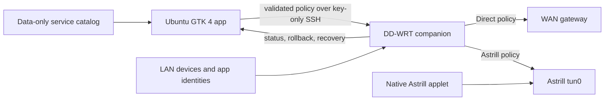

<div align="center">

[English](README.md) · [العربية](i18n/README.ar.md) · [Español](i18n/README.es.md) · [Français](i18n/README.fr.md) · [日本語](i18n/README.ja.md) · [한국어](i18n/README.ko.md) · [Tiếng Việt](i18n/README.vi.md) · [中文 (简体)](i18n/README.zh-Hans.md) · [中文（繁體）](i18n/README.zh-Hant.md) · [Deutsch](i18n/README.de.md) · [Русский](i18n/README.ru.md)

[](https://lazying.art)

# Astrill Lazy Router

**Choose Direct or Astrill per service, website, device, and application without replacing the router's native Astrill applet.**

[](https://github.com/lachlanchen/astrill-lazy-router/actions/workflows/ci.yml)
[](pyproject.toml)
[](docs/DESKTOP_APP.md)
[](docs/ROUTER_INSTALL.md)
[](docs/RULE_MODEL.md)
[](LICENSE)
[](https://github.com/sponsors/lachlanchen)
[](https://lazying.art)

</div>

Astrill Lazy Router is a native Ubuntu control application and a small DD-WRT
companion. It adds explicit policy routing beside Astrill while keeping
Astrill responsible for its own tunnel, server, DNS behavior, and native
website/device rules.


## At a glance

| Area | Capability |
| --- | --- |
| Routing | Direct WAN or the router's currently active Astrill tunnel |
| Selectors | Service, company, website, IPv4 network, LAN device, protocol, port, and isolated Ubuntu application |
| Catalog | 261 maintained profiles with search and provider-country, category, and type filters |
| Batch workflow | Select the visible result and apply Suggested, Direct, or Astrill to new and existing policies |
| Native sync | Bidirectional website, device, interface, DNS, connection, and advanced Astrill settings |
| Router safety | Validated input, separate marks/tables, transactional A/B activation, rollback, and watchdog recovery |
| Recovery | One action removes every companion-owned object and restores native Astrill-only operation |

> [!IMPORTANT]
> The router has one Astrill tunnel and therefore one active VPN endpoint.
> Policy countries are preferences for that shared tunnel, not simultaneous
> independent connections. Provider-country filtering in Services is catalog
> metadata and does not silently change the endpoint.

## Why it exists

Native Astrill routing modes are useful but broad. Astrill Lazy adds a
maintainable decision layer for workflows such as:

- keep UU Remote, WeChat, Taobao, Meituan, or Nutstore on Direct;
- keep Google, YouTube, Instagram, GitHub, or ChatGPT on Astrill;
- apply one route to a filtered group of China, United States, Japan, Europe,
  or other provider profiles;
- route one LAN device differently without changing every other device;
- give an Ubuntu application its own DHCP identity and router policy;
- compare Direct and Astrill paths before explicitly accepting a recommendation.

The policy layer is incremental. Native Astrill classifications retain higher
precedence, and the companion uses separate firewall mark bits and routing
tables.

## Architecture



The desktop owns editable policy and presentation. The router owns packet
classification, domain resolution, policy tables, and runtime recovery.
Astrill remains an independent privileged applet.

## Core controls

### Services

Search 261 company, application, and website profiles, combine country,
category, and type filters, then select one row or the complete visible
result. Batch modes have explicit behavior:

| Mode | Result |
| --- | --- |
| Suggested | Preserve each service's maintained Direct/Astrill default and preferred endpoint country |
| Direct | Force selected service policies to the WAN |
| Astrill | Preserve an existing VPN country or use the catalog/active endpoint fallback |

Rows with an existing policy show its actual route. Other rows show the
catalog suggestion, so the list retains its intended mixed Direct/Astrill
view.

### Policies and countries

Every rule has an enable switch, Direct/Astrill mode, priority, and optional
country preference. The Countries view summarizes requested regions and warns
when several policies request countries that one physical tunnel cannot serve
simultaneously.

### Native Astrill and endpoints

The Astrill view mirrors supported native settings through an explicit
allowlist. The Endpoints view discovers the applet's server list, shows the
current endpoint, and performs a confirmed reconnect when switching servers.

### Devices and applications

The companion merges DHCP leases, static reservations, and active LAN
neighbors. Ubuntu application profiles use a validated Polkit helper and a
macvlan network namespace to obtain an independent router-visible identity.

## Safety model

- The companion never edits Astrill applet files.
- Native Astrill marks and classifications retain precedence.
- Direct and Astrill policies use separate high mark bits and tables.
- VPN-targeted policy is fail-closed while `tun0` is unavailable.
- A/B activation leaves the previous ruleset active until the replacement is
  complete.
- Domain refresh retains prior addresses when a transient lookup fails.
- Automatic reconciliation does not rewrite healthy or fingerprint-identical
  router packages.
- `Restore Astrill Only` removes companion state without changing the selected
  Astrill endpoint, protocol, or connection state.
- Catalog extensions are declarative data and never execute on the router.

Read the complete [security model](docs/SECURITY.md) before deploying to a
shared or untrusted LAN.

## Quick start

### Requirements

- Python 3.11 or newer;
- GTK 4, Libadwaita, and Python GObject introspection on Ubuntu;
- a DD-WRT router with a working Astrill applet;
- key-only root SSH available through the `astrill-router` host alias;
- enough router NVRAM for the packaged companion.

Review [router prerequisites and rollback](docs/ROUTER_INSTALL.md) before the
first router installation.

### Install the desktop app

```bash
git clone git@github.com:lachlanchen/astrill-lazy-router.git
cd astrill-lazy-router
./scripts/install-desktop.sh
```

Launch from the Ubuntu application menu or run:

```bash
astrill-lazy-gui
```

The user-local installer creates an editable virtual environment, enables
login startup, and installs the desktop launcher. When companion mode is
enabled, the GUI checks the router at startup and repairs or installs only
when required.

### Useful CLI commands

```bash
astrill-lazy status
astrill-lazy apply
astrill-lazy servers
astrill-lazy refresh
astrill-lazy rollback
astrill-lazy install-router
astrill-lazy autostart status
astrill-lazy device-policy validate examples/device-policy.sample.json
```

## Development

```bash
python3 -m venv --system-site-packages .venv
.venv/bin/python -m pip install --editable ".[dev]"
.venv/bin/pytest
.venv/bin/ruff check desktop tests scripts
.venv/bin/ruff format --check desktop tests scripts
PYTHONPATH=desktop python3 scripts/validate-catalog.py
```

Run the GUI on an isolated display without taking focus from the active
desktop:

```bash
./scripts/install-novnc-service.sh
systemctl --user enable --now \
  io.github.lachlanchen.AstrillLazyRouter.NoVNC.service
```

See [desktop application testing](docs/DESKTOP_APP.md) for the local noVNC
address and teardown command.

## Validated deployment

| Component | Validated system |
| --- | --- |
| Router | Linksys E4200 |
| Firmware | DD-WRT `v3.0-r62374 mega` |
| Astrill applet | `2.9.52` |
| Desktop | Ubuntu with GTK 4 and Libadwaita |
| Policy engine | IPv4, one active Astrill tunnel |
| Catalog | 261 profiles, 19 categories, 9 provider-country groups |

Other DD-WRT hardware may work, but package size, NVRAM, shell utilities,
firewall behavior, and Astrill integration must be verified independently.

## Documentation

| Document | Scope |
| --- | --- |
| [Architecture](docs/ARCHITECTURE.md) | Components, packet path, precedence, A/B activation, and recovery |
| [Astrill analysis](docs/ASTRILL_ANALYSIS.md) | Observed applet behavior and DD-WRT integration |
| [Desktop application](docs/DESKTOP_APP.md) | Every GUI view, startup, noVNC, and application identities |
| [Router installation](docs/ROUTER_INSTALL.md) | Prerequisites, installation, persistence, operations, and rollback |
| [Rule model](docs/RULE_MODEL.md) | Selectors, priorities, compilation, and native composition |
| [Device-local routing](docs/DEVICE_ROUTING.md) | Validated non-enforcing multi-endpoint policy model |
| [Extensions](docs/EXTENSIONS.md) | Data-only service, country, and region catalogs |
| [Backup and restore](docs/BACKUP_RESTORE.md) | Encrypted backup boundaries and recovery |
| [Security](docs/SECURITY.md) | Trust boundaries, input validation, routing safety, and secrets |
| [Testing](docs/TESTING.md) | Automated and live acceptance evidence |
| [Changelog](CHANGELOG.md) | Release history |

## Internationalization

The complete technical reference is maintained in English. Ten concise
localized guides live under [`i18n/`](i18n/) and share the same 11-language
navigation header. Commands, identifiers, and safety semantics remain
canonical across translations.

## Support

| Donate | PayPal | Stripe |
| --- | --- | --- |
| [](https://chat.lazying.art/donate) | [](https://paypal.me/RongzhouChen) | [](https://buy.stripe.com/aFadR8gIaflgfQV6T4fw400) |

You can also support continued work through
[GitHub Sponsors](https://github.com/sponsors/lachlanchen).

## License and attribution

Released under the [MIT License](LICENSE).

Astrill is a third-party product and trademark. This independent project is
not affiliated with or endorsed by Astrill. It does not provide Astrill
accounts, credentials, servers, or a way around provider connection limits.

Part of [The Art of Lazying](https://lazying.art): build less, live more.
