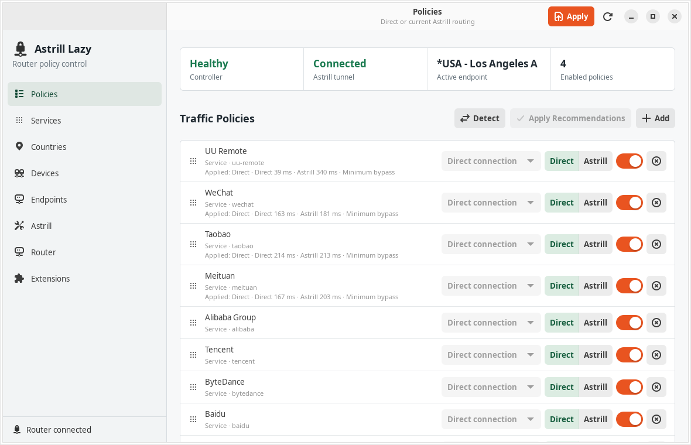
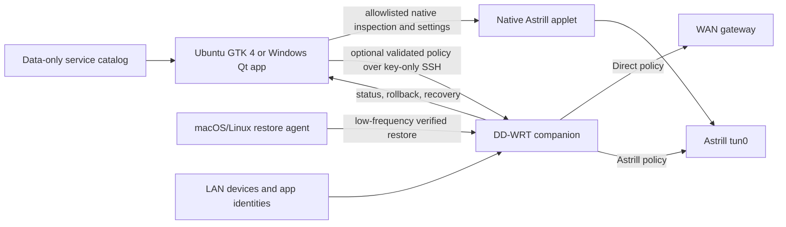

<div align="center">

[English](README.md) · [العربية](i18n/README.ar.md) · [Español](i18n/README.es.md) · [Français](i18n/README.fr.md) · [日本語](i18n/README.ja.md) · [한국어](i18n/README.ko.md) · [Tiếng Việt](i18n/README.vi.md) · [中文 (简体)](i18n/README.zh-Hans.md) · [中文（繁體）](i18n/README.zh-Hant.md) · [Deutsch](i18n/README.de.md) · [Русский](i18n/README.ru.md)

[](https://lazying.art)

# Astrill Lazy Router

**Choose Direct or Astrill per service, website, device, and application without replacing the router's native Astrill applet.**

[](https://github.com/lachlanchen/astrill-lazy-router/actions/workflows/ci.yml)
[](pyproject.toml)
[](docs/DESKTOP_APP.md)
[](docs/ROUTER_INSTALL.md)
[](docs/RULE_MODEL.md)
[](LICENSE)
[](https://github.com/sponsors/lachlanchen)
[](https://lachlanchen.github.io/astrill-lazy-policies/)
[](https://lazying.art)

</div>

Astrill Lazy Router provides native Ubuntu and Windows control applications,
a portable macOS/Linux restore agent, and an optional small DD-WRT companion.
Either frontend can safely inspect an already-working native Astrill router
without installing anything, or add explicit policy routing beside Astrill
after write access and companion deployment are deliberately enabled.



## At a glance

| Area | Capability |
| --- | --- |
| Routing | Direct WAN or the router's currently active Astrill tunnel |
| Selectors | Service, company, website, IPv4 network, LAN device, protocol, port, and isolated application on Ubuntu |
| Catalog | 261 maintained profiles with search and provider-country, category, and profile-type filters |
| Batch workflow | Durable checkbox/Ctrl/Command/Shift selection, Select visible, and explicit Suggested, Direct, or Astrill policy creation |
| Native sync | Bidirectional routing, DNS, endpoint, protocol, port, transport, favorite, and resilience settings |
| Cross-platform 0.3.0 | Shared layered policy, hash-bound public bundles, and source-scoped Ubuntu, macOS, and Windows reboot recovery |
| Native-only audit | Read-only status, settings, endpoints, and LAN clients with no companion or router writes |
| Router safety | Validated input, separate marks/tables, transactional A/B activation, rollback, and watchdog recovery |
| Recovery | One action removes every companion-owned object and restores native Astrill-only operation |

> [!IMPORTANT]
> The router has one Astrill tunnel and therefore one active VPN endpoint.
> Policy countries are preferences for that shared tunnel, not simultaneous
> independent connections. Provider-country filtering in Services is catalog
> metadata and does not silently change the endpoint.

## Why it exists

Native Astrill routing modes are useful but broad. Astrill Lazy adds a
maintainable decision layer for workflows such as:

- keep UU Remote, WeChat, Taobao, Meituan, or Nutstore on Direct;
- keep Google, YouTube, Instagram, GitHub, or ChatGPT on Astrill;
- apply one route to a filtered group of China, United States, Japan, Europe,
  or other provider profiles;
- route one LAN device differently without changing every other device;
- give an Ubuntu application its own DHCP identity and router policy;
- compare Direct and Astrill paths before explicitly accepting a recommendation.

The policy layer is incremental. The companion uses separate high firewall
mark bits and routing tables. After Astrill creates its native policy rules,
the companion allocates and verifies an owned pair of free lookups immediately
ahead of them. It leaves unmatched traffic with the native applet. If an
unmanaged native reconnect undercuts that pair, the companion keeps policy
health degraded and rebase-required instead of allocating progressively lower
preferences. An observed disconnect or explicit managed reconnect performs the
safe rebase with companion lookups absent during Astrill startup.

Tunnel state and policy health are separate. A connected tunnel with an
unverified overlay is reported as degraded instead of presenting the bypass as
healthy. While disconnected, the VPN policy remains fail-closed and the owned
route lookups are intentionally absent until native rules exist again.

## Architecture



The desktop owns editable policy and presentation. The router owns packet
classification, domain resolution, policy tables, and runtime recovery.
Astrill remains an independent privileged applet.

## Core controls

### Services

Search 261 company, application, and website profiles, combine provider
country, category, and profile-type filters, then select rows with checkboxes,
normal Ctrl/Command or Shift selection, or the tri-state **Select visible**
control. Selections remain durable while filters change, and the selected
count reports rows hidden by the current result. Batch modes have explicit
behavior:

| Mode | Result |
| --- | --- |
| Suggested | Preserve each service's maintained Direct/Astrill default and preferred endpoint country |
| Direct | Force selected service policies to the WAN |
| Astrill | Preserve an existing VPN country or use the catalog/active endpoint fallback |

Rows with an existing policy show its actual route. Other rows show the
catalog suggestion, so the list retains its intended mixed Direct/Astrill
view. **Add to Policies** saves the selected rules locally; only a separately
confirmed core-replacement or RAM-overlay action changes the router.
With companion `0.2.12`, the Policies view separates five states: the complete
local library, the small reboot-persistent router core, this computer's
source-scoped RAM overlay, other controllers' overlays, and the composed
effective policy. Exact origin IDs, generations, and content hashes expose
drift without replacing another controller's work.

The persistent core retains the conservative 6,144-byte compiled-document and
live NVRAM-headroom limits. **Replace persistent core** is an explicit global
administrator action. Larger selected sets can instead be loaded into this
computer's volatile RAM overlay after row, byte, generated-match, memory, and
build-duration admission checks. The overlay is bound to the controller's
source address and observed bridge MAC, performs no NVRAM commit, and can be
restored once after a router reboot when the user has opted in. Neither path
silently truncates or partially installs its chosen scope.

The verified E4200 deployment uses a 3-origin/41-row persistent core and an
85-origin/275-row Windows overlay. Its 316-row effective document restored once
after physical reboot into source `192.168.1.166/32` and MAC
`54:bf:64:80:aa:23`; fresh DNS produced 693 generated matches and 1,392 chain
rules. The GUI remained responsive during the roughly 200-second one-shot
restore, NVRAM remained at 2,494 free bytes, and Astrill was left disconnected.

For example, search for **UU Remote**, select it, choose **Direct**, and select
**Add to Policies**. That creates a local Direct policy which can then be
reviewed and explicitly applied. UU Remote is not seeded or applied by
default.

UU Remote also uses dynamic UDP ICE, relay, and peer destinations that may not
resolve from a maintained service hostname. A destination-domain profile
therefore covers known control and relay hosts but cannot promise every media
path. Use a narrowly scoped source-device Direct rule when routing the whole
device is acceptable, or a process-aware device-local routing backend when
only UU should bypass. Do not add broad hosting-provider networks to a service
profile. Nutstore includes its documented `dav.jianguoyun.com` WebDAV host,
but both profiles intentionally keep protocol and port unrestricted.

### Policies and countries

Every rule has an enable switch, Direct/Astrill mode, priority, and optional
country preference. The Countries view summarizes requested regions and warns
when several policies request countries that one physical tunnel cannot serve
simultaneously.

### Connection, endpoints, and native Astrill

Ubuntu and Windows both provide a dedicated **Connection** view for the
router's one shared tunnel. It mirrors selected endpoint, supported UDP/TCP
transport, endpoint-specific port, favorite state, cipher, MTU, acceleration,
kill switch, favorite cycling, and router-boot connection. Its server list
comes from the installed applet.

On Windows, **Save** verifies a changed draft without starting a disconnected
tunnel, **Connect** uses an already-saved clean draft, **Apply & Connect** or
**Apply & Reconnect** performs the confirmed transaction, and **Disconnect**
preserves the saved endpoint, favorites, and policies. The transaction works
with or without the companion: the companion switch restores its prior
endpoint on failure, while native-only mode restores the prior allowlisted
values and active session when possible. Concurrent router refreshes preserve
an unsaved form and surface a conflict instead of silently replacing it.
Favorite membership edits use a separate fresh-read, compare-before-write
merge before Save or Apply, so a stale Connection draft cannot replace an
external favorite change. If a later connection step fails, the UI explicitly
reports that the already-verified favorite edit remains saved.

The Windows **Endpoints** view remains the quick-connect and bulk-management
surface. Its exact-country filter compares complete catalog country names.
Checkboxes, Ctrl/Command and Shift selection, and tri-state **Select visible**
remain durable across search, filtering, and sorting; connecting requires
exactly one selected endpoint. Clickable headers sort Select, Endpoint,
Region, Favorite, Server ID, Router state, Nodes, PC latency, Reach, and Tested
by their semantic values rather than displayed text. Numeric fields remain
numeric and missing results stay last in either direction.

Both frontends offer a manual-only bounded TCP reachability test from the
desktop's current network path. Ubuntu's **Ping** action measures the visible
rows. Its aligned Country, Ping, and Action columns can be sorted by country or
by fastest/slowest measured latency, with unavailable results kept below valid
measurements. Windows **Test PC latency** can measure the selected, visible, or
all loaded rows.

The tests send no command to DD-WRT, do not measure bandwidth, and never switch
the endpoint. The separately confirmed Windows connect action changes DD-WRT
only; it neither installs a VPN nor changes local PC routing.

Windows saves manual results locally until they are cleared or replaced, shows
their tested time, and marks old or changed-target results for a manual retest.
The endpoint list can restore Astrill's default order, group by region, sort
current results by numeric PC latency, or use any semantic table header without
running another test.

The Windows endpoint table also has a **Favorite** column backed by DD-WRT's
native `astrill_favlist`. Favorites are read after the endpoint catalog loads,
on **Sync from router**, and from verified action readbacks. **Favorite
selected** and **Unfavorite selected** validate the whole selection before any
write, preserve every other record and its order, reject concurrent changes,
commit the complete batch at most once, and verify the full readback. They do
not require the companion, reconnect Astrill, switch endpoints, run a latency
test, or start a recurring SSH poll.

Malformed router favorite data is displayed but preserved and cannot be
edited. Windows favorite changes are blocked while either Astrill or
Connection has unsaved edits, preventing a refresh from discarding a local
draft. Both frontends synchronize the Connection page's selected-endpoint
favorite with the same native value and preserve dirty-page conflicts.

The Windows **Astrill** view organizes the complete safe native mirror into
seven human-readable sections: **Overview**, **Connection**, **Routing**,
**Privacy & DNS**, **Devices**, **Resilience**, and **Advanced**. Ubuntu and
Windows remain backed by the same explicit NVRAM allowlist. Router state is
read at launch and on explicit refresh, page demand, or completed actions; the
desktop does not run a recurring SSH poll. Pending edits are retained and a
reload conflict is shown instead of silently replacing them.

### Devices and applications

The companion merges DHCP leases, static reservations, and active LAN
neighbors. Ubuntu application profiles use a validated Polkit helper and a
macvlan network namespace to obtain an independent router-visible identity.
For a bounded download, provider API call, or other terminal task, use the
same isolation without changing the host-wide route:

```bash
astrill-lazy access read-write
astrill-lazy isolated-run \
  --allow-domain example.com \
  -- curl -fLO https://example.com/file
```

`isolated-run` resolves every explicitly allowed domain before changing the
router, allocates a disposable namespace, and permits only those IPv4
destinations on the selected TCP ports (`443` by default). It verifies that the
ordinary host is Direct in native Astrill policy and installs temporary TCP and
UDP Direct guards for that host before the task receives its source-scoped TCP
VPN flow. It preserves an already connected Astrill tunnel and removes the
namespace, firewall, and flows when the command exits. When it connected
Astrill itself, it disconnects only after cleanup succeeds. Repeat
`--allow-domain` or `--allow-port` only for destinations the task actually
needs. Domain limits are enforced by resolved IPv4 destination, so shared CDN
addresses remain an IP-layer boundary rather than an HTTP hostname boundary.
Companion `0.2.14` derives its VPN route from either Astrill's legacy split
default or its active native policy table, and transient flow deletion remains
available while a tunnel is degraded so cleanup cannot be trapped behind the
failure it is trying to remove. Its managed connection window is 90 seconds,
covering the measured favorite failover without allowing an unowned late
tunnel.

If the LAN resolver returns a blocked or poisoned answer, pin one or more
explicit IPv4 resolvers for that task. The same resolver list is installed only
inside the disposable namespace, and the destination allowlist is built from
the union of those exact A records. Those records are also pinned in the
namespace's private hosts file so the application and firewall use one
deterministic mapping:

```bash
astrill-lazy isolated-run \
  --dns-server 1.1.1.1 \
  --dns-server 8.8.8.8 \
  --allow-domain oauth2.googleapis.com \
  -- command-that-needs-google-oauth
```

DNS itself stays limited to port 53 for those resolver addresses. The task's
application traffic remains limited to the requested domains' resolved IPv4
addresses and requested TCP ports.

For a phone or another external LAN device, `device-flow` creates a separate
RAM-only route bound to one exact IPv4 address and verified MAC address. It
accepts explicit domains and TCP/UDP ports, rejects wildcard domains and broad
source networks, and leaves this computer's traffic unchanged. See the
[external-device flow guide](docs/EXTERNAL_DEVICE_FLOW.md).

The optional macOS UU reporter registers only the signed app's persistent UDP
media source port in a bounded transient companion chain; it does not exclude
the Mac or route all of its UDP traffic directly.
The native Windows frontend supports device policies but deliberately has no
per-application WFP backend; see the
[Windows application guide](docs/WINDOWS_APP.md).

## Safety model

- The companion never edits Astrill applet files.
- Companion `0.2.12` removes its recorded lookups before a managed Astrill
  start, waits for the native rules to settle, then allocates and verifies two
  free adjacent preferences immediately ahead of the native minimum. It
  uses recorded preferences when available; if that record is missing, cleanup
  scans only exact companion mark, mask, and table signatures and preserves
  unrelated rules.
- Transient application socket rules are limited to 16 validated rows in a
  separate chain, are restored by a change-driven client reporter, and are
  never committed to router NVRAM.
- The small core remains reboot-persistent and uses gzip/base64 storage when
  smaller. Owner-scoped overlays and the composed effective document stay in
  RAM, and overlay changes perform no NVRAM commit.
- Persistent NVRAM contains only the base companion package, a deterministic
  gzip/base64 bootstrap payload, and the small core. The 6,502-byte normalized
  bootstrap occupies 2,560 stored bytes; `alhybrid`, workstation overlays,
  effective policy, epochs, and layer generations remain RAM-only.
- Direct and Astrill policies use separate high mark bits and tables.
- VPN table `212` retains a lower-priority blackhole fallback while `tun0` is
  active and uses the blackhole as its only default while disconnected, so
  VPN-targeted traffic remains fail-closed across tunnel loss.
- An unmanaged native undercut remains visibly degraded and rebase-required;
  the watchdog does not ratchet companion preferences downward.
- A/B activation leaves the previous ruleset active until the replacement is
  complete. Large overlay loads prefetch each unique enabled domain with at
  most eight resolver jobs and a five-second limit per lookup, then dry-run and
  commit one `iptables-restore --noflush` document into the unreferenced
  inactive chain.
- Core and overlay writes stage the desktop-shipped RAM transaction helper,
  then verify expected version, running/stored package MD5, and helper MD5
  under the shared controller lock before changing policy state.
- Install, upgrade, and Restore Astrill Only use that same lock with
  exact-byte NVRAM compare-and-swap and verified rollback/removal readback.
- Core updates retain the 6,144-byte compiled-policy and 2 KiB live NVRAM
  reserve checks. RAM overlays have separate byte, row, generated-match,
  reclaimable-memory, and transaction-duration admission limits.
- A fresh domain refresh retains the prior validated addresses when a transient
  lookup fails. Topology, reclaimable memory, transaction deadline, and exact
  chain readback are checked around the batched inactive-chain commit.
- Automatic reconciliation does not rewrite healthy or fingerprint-identical
  router packages.
- Connection writes are allowlisted and read back exactly; a failed native
  reconnect restores the prior values and active session when possible.
- Endpoint switching allows up to 60 seconds for both connected state and
  `tun0` before rollback; rollback restores the original selected endpoint and
  whether its tunnel was connected or disconnected, or reports explicitly
  when that recovery cannot be verified.
- Windows favorite changes use a fresh read plus compare-before-write
  batch replacement, at most one NVRAM commit, and exact readback without
  reconnecting the tunnel.
- Router-local maintenance ensures runtime every 60 seconds. A core-only policy
  can still refresh domains every 30 minutes, but an active RAM overlay is
  rebuilt only by an explicit load, one-shot startup/network restoration, or a
  manual restore/reload; neither the watchdog nor the Windows desktop polls and
  rebuilds overlays.
- After changing policy, reconnect only the affected applications so their
  new connections receive the new route; do not clear router-wide connection
  tracking.
- `Restore Astrill Only` removes companion state without changing the selected
  Astrill endpoint, protocol, or connection state.
- Catalog extensions are declarative data and never execute on the router.
- Fresh configurations are native-only and read-only; legacy companion
  configurations retain their saved behavior.

Read the complete [security model](docs/SECURITY.md) before deploying to a
shared or untrusted LAN.

## Quick start

### Requirements

- Python 3.11 or newer for a source installation or Windows build;
- GTK 4, Libadwaita, and Python GObject introspection for Ubuntu;
- PySide6 and Windows OpenSSH Client for the native Windows build;
- a DD-WRT router with a working Astrill applet;
- LAN access to DD-WRT SSH (first-run defaults are `192.168.1.1`, user `root`,
  port `22`, and a dedicated Ed25519 identity path; both native apps can
  generate and authorize it, with Windows using one-time LAN Telnet setup);
- enough router NVRAM for the packaged companion.

Review [router prerequisites and rollback](docs/ROUTER_INSTALL.md) before the
first router installation.

For a stock Linksys E4200 v1, follow the separate
[E4200 DD-WRT and Astrill tutorial](docs/tutorials/e4200-dd-wrt-astrill/README.md)
before installing the optional companion.

### Install on Ubuntu

```bash
git clone git@github.com:lachlanchen/astrill-lazy-router.git
cd astrill-lazy-router
./scripts/install-desktop.sh
```

Launch from the Ubuntu application menu or run:

```bash
astrill-lazy-gui
```

The user-local installer creates an editable virtual environment and installs
the desktop launcher. A fresh configuration is native-only and read-only, and
login startup is opt-in:

```bash
ASTRILL_LAZY_ENABLE_AUTOSTART=1 ./scripts/install-desktop.sh
```

The GUI automatically checks SSH, the native Astrill applet, and the companion.
It prepares the local SSH identity without a password and repairs only a
verified current companion package automatically. Router key authorization, a
user-supplied Astrill installer, and companion installation each require an
explicit confirmation. Passwords, installer scripts, and installer tokens are
never saved in the desktop configuration.

### Build and install on Windows

The Windows frontend is a native Qt application. It does not require WSL or
noVNC:

```powershell
powershell.exe -NoProfile -ExecutionPolicy Bypass `
  -File .\contrib\windows\build-native.ps1
powershell.exe -NoProfile -ExecutionPolicy Bypass `
  -File .\contrib\windows\install-native.ps1
```

The per-user installer creates a Desktop shortcut and a current-user Startup
shortcut, deliberately creates no Start Menu entry, and does not launch the
app during installation. The Startup shortcut opens the app automatically
after Windows sign-in, including the first sign-in after a reboot. Startup
reuses a healthy companion, restores its validated runtime from retained
router NVRAM when `/tmp` was cleared, or falls back to native-only mode when
the router no longer has it. It never silently rewrites a missing or
incompatible companion. Before the first connection, use **Set up key via
Telnet** to confirm the DD-WRT SSH fingerprint, generate the dedicated key,
send its public half through the one-time LAN Telnet session, and verify strict
key-only Windows OpenSSH access.
See [Native Windows Application](docs/WINDOWS_APP.md) for the complete build,
installation, safety, and host-key procedure.

### Useful CLI commands

```bash
astrill-lazy status
astrill-lazy inspect
astrill-lazy access status
astrill-lazy apply
astrill-lazy servers
astrill-lazy refresh
astrill-lazy rollback
astrill-lazy preflight-router
astrill-lazy install-router
astrill-lazy autostart status
astrill-lazy agent plan
astrill-lazy policy-bundle inspect POLICY.json
astrill-lazy device-policy validate examples/device-policy.sample.json
```

## Development

```bash
python3 -m venv --system-site-packages .venv
.venv/bin/python -m pip install --editable ".[dev]"
.venv/bin/pytest
.venv/bin/ruff check desktop tests scripts
.venv/bin/ruff format --check desktop tests scripts
PYTHONPATH=desktop python3 scripts/validate-catalog.py
shellcheck -x -s sh contrib/portable/*.sh router/alpage router/alpage-ui
```

Run the GUI on an isolated display without taking focus from the active
desktop:

```bash
./scripts/install-novnc-service.sh
systemctl --user enable --now \
  io.github.lachlanchen.AstrillLazyRouter.NoVNC.service
```

See [desktop application testing](docs/DESKTOP_APP.md) for the local noVNC
address and teardown command.

## Validated deployment

| Component | Validated system |
| --- | --- |
| Router | Linksys E4200 |
| Firmware | DD-WRT `v3.0-r62374 mega` |
| Astrill applet | `2.9.52` |
| Desktop | Ubuntu with GTK 4 and Libadwaita; Windows 11 with native Qt; macOS portable agent |
| Policy engine | IPv4, one active Astrill tunnel |
| Catalog | 261 profiles, 19 categories, 9 provider-country groups |

The native-only path was also validated on a second E4200 that already used
Astrill Include mode. Direct and listed-VPN egress were confirmed without
installing the companion or changing its policy.

Other DD-WRT hardware may work, but package size, NVRAM, shell utilities,
firewall behavior, and Astrill integration must be verified independently.

## Documentation

| Document | Scope |
| --- | --- |
| [Architecture](docs/ARCHITECTURE.md) | Components, packet path, precedence, A/B activation, and recovery |
| [Astrill analysis](docs/ASTRILL_ANALYSIS.md) | Observed applet behavior and DD-WRT integration |
| [Desktop application](docs/DESKTOP_APP.md) | Every GUI view, startup, noVNC, and application identities |
| [Native Windows application](docs/WINDOWS_APP.md) | Native build, per-user install, SSH trust, safety, and Windows limitations |
| [Router installation](docs/ROUTER_INSTALL.md) | Prerequisites, installation, persistence, operations, and rollback |
| [Native-only operation](docs/NATIVE_ONLY.md) | Safe inspection, write guard, second-router evidence, and DD-WRT SSH lessons |
| [Rule model](docs/RULE_MODEL.md) | Selectors, priorities, compilation, and native composition |
| [Hybrid policy storage](docs/HYBRID_POLICY_STORAGE.md) | Persistent core, owner-scoped RAM overlays, reboot restoration, capacity limits, and recovery |
| [Portable restore agent](docs/PORTABLE_AGENT.md) | Source/MAC enrollment, macOS/Linux startup, low-frequency recovery, and upgrades |
| [Policy distribution](docs/POLICY_DISTRIBUTION.md) | Public workspace, catalog-only schema, exact hashes, import, export, and publication |
| [Device-local routing](docs/DEVICE_ROUTING.md) | Validated non-enforcing multi-endpoint policy model |
| [Extensions](docs/EXTENSIONS.md) | Data-only service, country, and region catalogs |
| [Backup and restore](docs/BACKUP_RESTORE.md) | Encrypted backup boundaries and recovery |
| [Security](docs/SECURITY.md) | Trust boundaries, input validation, routing safety, and secrets |
| [Testing](docs/TESTING.md) | Automated and live acceptance evidence |
| [Changelog](CHANGELOG.md) | Release history |

## Internationalization

The complete technical reference is maintained in English. Ten concise
localized guides live under [`i18n/`](i18n/) and share the same 11-language
navigation header. Commands, identifiers, and safety semantics remain
canonical across translations.

## Support

| Donate | PayPal | Stripe |
| --- | --- | --- |
| [](https://chat.lazying.art/donate) | [](https://paypal.me/RongzhouChen) | [](https://buy.stripe.com/aFadR8gIaflgfQV6T4fw400) |

You can also support continued work through
[GitHub Sponsors](https://github.com/sponsors/lachlanchen).

## License and attribution

Released under the [MIT License](LICENSE).

Astrill is a third-party product and trademark. This independent project is
not affiliated with or endorsed by Astrill. It does not provide Astrill
accounts, credentials, servers, or a way around provider connection limits.

Part of [The Art of Lazying](https://lazying.art): build less, live more.
